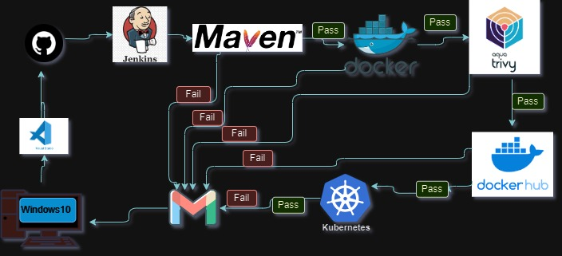

 #  **Implementing a Fundamental CI/CD Pipeline on a Local Windows 10 System** 

This project demonstrates how to set up a fundamental Continuous Integration/Continuous Deployment (CI/CD) pipeline on a local Windows 10 system. The pipeline is designed for a Java application and utilizes several tools and technologies including **Jenkins**, **Maven**, **Docker**, **Kubernetes**, and **Cloudflare**.

## **Prerequisites**

The following tools and technologies are required for this project:

1. **Jenkins**: An open-source automation server that enables developers to build, test, and deploy their software.
2. **Maven and JDK**: Maven is a build automation tool used primarily for Java projects. The Java Development Kit (JDK) is a software development environment used for developing Java applications.
3. **Docker and Kubernetes**: Docker is a platform used to develop, ship, and run applications inside containers. Kubernetes is a container orchestration platform for automating deployment, scaling, and management of containerized applications.
4. **Cloudflare**: Used to make localhost accessible as a public host.
5. **GitHub Repo**: A repository hosting service for version control using Git.
6. **Jenkins Plugins**: Kubernetes Plugin, Kubernetes CLI, Docker Pipeline, Docker Plugin.
7. **Notification Tool**: Gmail SMTP server for sending email notifications.
8. **OS**: Windows 10.
9. **Package Manager**: Chocolatey, used to install Trivy, a simple and comprehensive vulnerability scanner for containers.
10. **Code Editor**: Visual Studio Code, A powerful and customizable code editor by Microsoft, ideal for this project.
11. **AI assistance**: With the help of Copilot, I have written some code, resolved errors, and prepared a document.

## **Setup and Execution**

### **Email Notification Setup**

An additional stage for email notification is included in the pipeline. This means that whenever the pipeline is executed, it sends an email notification regardless of whether the pipeline passes or fails. 

### **GitHub Integration**

GitHub Integration with Jenkins via Webhook: Automate your CI/CD pipeline by integrating GitHub with Jenkins. This eliminates the need for manual building each time there’s a code update in your GitHub repository. 

### **Pipeline Execution**

This Jenkinsfile is a Continuous Integration (CI) and Continuous Deployment CD pipeline that builds a Java application into an executable .jar file and pushes it to Dockerhub, and deploys it to a Kubernetes cluster. It includes stages for cleaning up the workspace, checking out the code from **Git**, running unit tests and integration tests with **Maven**, building a **Docker** image, scanning the image for vulnerabilities with **Trivy**,  pushing the image to Dockerhub, and deploys it to a **Kubernetes** cluster. It includes stages for cleaning up Docker images, deploying to Kubernetes, and sending an email report after the build

## **Common Errors and Solutions**

During the execution of the CI/CD pipeline, you may encounter several issues. Here are some common errors and their solutions:

- **Path Setup and Syntax Issues**: When cloning the repo, it clones and stores the files in the workspace under the Jenkins home directory. From that workspace directory, we should run the Maven commands. However, it was unable to take the exact location of the file while executing Maven. It showed that it was unable to find the files. Actually, one wrong syntax/step was added like `dir("path_to_loc")`. This was a major mistake. After several solutions, I found that I needed to remove this step (`dir("path_to_loc")`) from the scripts and it successfully executed. Syntax issues included spacing, flower brackets, and adding wrong syntax keywords.

- **Docker Build Error**: When running the command `docker build -t javapp:38 .` in the Jenkins workspace `C:\Users\Username\.jenkins\workspace\javapp`, the following error occurred: `ERROR: error during connect: in the default daemon configuration on Windows, the docker client must be run with elevated privileges to connect: Get "http://%2F%2F.%2Fpipe%2Fdocker_engine/_ping": open //./pipe/docker_engine: The system cannot find the file specified.` Check/Verify if the Docker application is running. If not, start the application to resolve the problem.

- **Docker Push Error**: When executing the command `docker push ${DOCKER_USERNAME}/${JOB}:v${BUILD_NUMBER}` in the Jenkins workspace `C:\Users\Username\.jenkins\workspace\javapp`, an error occurred: `invalid reference format: repository name (${JOB}) must be lowercase`. The error was caused by the use of single quotation marks (`'`) in the `bat` command within the Docker push stage: `bat 'docker push ${DOCKER_USERNAME}/${JOB}:v${BUILD_NUMBER}'`. This prevented the string interpolation of the `${DOCKER_USERNAME}`, `${JOB}`, and `${BUILD_NUMBER}` variables. To resolve this issue, use double quotation marks (`"`) for string values in Groovy (the language used for Jenkinsfiles), as they allow for string interpolation (i.e., replacing `${...}` with the value of the variable within the string).

- **Docker Image Tag Error**: If you didn't push an image with the `latest` tag to the Docker registry, and you try to pull from the registry without specifying a tag, Docker will look for the `latest` tag by default. If it doesn't find an image with the `latest` tag, it will return an error. When you push an image to the registry, if you don't specify a tag, Docker will assign the `latest` tag to the image by default. However, if you push the image with a specific tag and don't push an image with the `latest` tag, Docker won't be able to find the `latest` image.

## **Conclusion**

This project provides a fundamental understanding of how to implement a CI/CD pipeline on a local Windows 10 system. It covers the basic setup and execution of the pipeline, and also addresses some common issues and their solutions. This project serves as a good starting point for anyone looking to understand and implement CI/CD pipelines in their development workflow.
