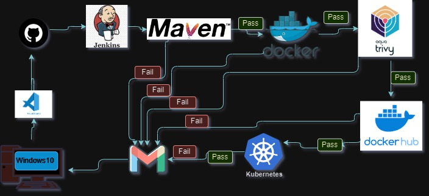

# 🚀 Project Description

This project aims to automate the process of software development, testing, and deployment using a variety of tools. Each tool has a specific role in the process, and the flowchart outlines how they interact with each other. The “Fail” paths indicate points where the process can be halted if certain criteria aren’t met, ensuring quality control.
        
## 🛠️ Tools Used

- **Jenkins**: Used for continuous integration and starts the process. Automates parts of the software development process with continuous integration and facilitates technical aspects of continuous delivery.
- **Maven**: Involved in the build process. It is a build automation tool used primarily for Java projects.
- **Docker**: Used for containerization; it receives input from Maven if the build passes. An open-source platform that automates the deployment, scaling, and management of applications within containers.
- **Docker Hub**: A repository for storing built containers that have passed all previous stages. A cloud-based registry service which allows you to link to code repositories, build your images and test them, stores manually pushed images, so you can deploy images to hosts (like k8s).
- **Kubernetes**: Involved in orchestration; it receives input if tests on Windows 10 pass. An open-source platform designed to automate deploying, scaling, and operating application containers.
- **Trivy**: A simple and comprehensive vulnerability scanner for containers. Used in this project for scanning container images for vulnerabilities.
- **Gmail**: Used for sending notifications or alerts during the development and deployment process.
- **Windows 10**: A platform where builds are tested.
